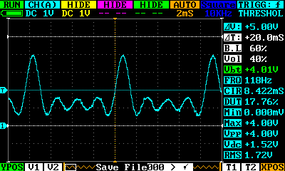

# avr-dac: Turn an AVR into a 1-bit D/A converter

This program turns an AVR microcontroller into a 1-bit DAC. The desired
analog level is loaded serially, like on a shift register, as an 8-bit
unsigned integer. Then, once the LATCH input pin is asserted, the level
is output as a pulse density modulated (PDM) waveform. Average waveform
voltage for level <i>n</i> is (<i>n</i>/256)<i>V</i><sub>CC</sub>. The
PDM waveform is generated by a software delta-sigma modulator clocked at
<i>f</i><sub>CPU</sub>/13 (615&nbsp;kHz for
<i>f</i><sub>CPU</sub>&nbsp;=&nbsp;8&nbsp;MHz).

The program is meant to work on any AVR microcontroller. It doesn’t use
any peripheral other than basic GPIO ports, and doesn’t use any RAM. It
has been tested on an ATtiny13A running at 8&nbsp;MHz off its internal
RC oscillator.

## Configuring

Edit the configuration section at the top of the program to set the
pinout, the clock prescaler and the polarity of the LATCH pin.

Inputs:

 * CLK: serial clock
 * DAT: serial data, clocked on rising CLK, most significant bit first
 * LATCH: latch the data, active-high unless configured otherwise

Output:

 * OUT: PDM output

The defaults are:

 * pinout: CLK = PB0, DAT = PB1, LATCH = PB2, OUT = PB3
 * clock prescaler = 1 (full clock speed)
 * LATCH is active-high

## Building

Type

```bash
avr-gcc -mmcu=... -nostdlib avr-dac.S -o avr-dac.elf
```

with the appropriate MCU model, or edit and use the included Makefile.

## Timings

The inputs should conform to the following requirements:

 * every input level should be held for at least 26 clock cycles
 * DAT setup = 0
 * DAT hold = 26 cycles
 * last CLK to LATCH = 26 cycles

The delta-sigma modulator is clocked every 13 cycles

Note that the Arduino’s `shiftOut()` and `digitalWrite()` are slow
enough to meet all these requirements.

## Internals

This program does not use interrupts. Instead, it runs a carefully
timed infinite loop, alternatively handling its inputs and outputs.
Within each 26-cycle loop iteration, the inputs are sampled once and
the output is updated twice. It should be noted that this loop uses
100% of the CPU cycles: attempting to perform any additional job would
disrupt the timing.

The CPU cycle count can be broken down as:

 * 2 × 5 cycles for the delta-sigma algorithm
 * 14 cycles for handling inputs
 * 2 cycles for closing the loop

## Test program

The companion sketch test-avr-dac.ino has been run on an Arduino Uno to
test avr-dac.S running on an ATtiny13A. The PDM output from the ATtiny
was filtered through an RC low-pass filter (R&nbsp;=&nbsp;1&nbsp;kΩ,
C&nbsp;=&nbsp;100&nbsp;nF) in order to get a true analog signal. Here is
the signal as seen on an oscilloscope:


